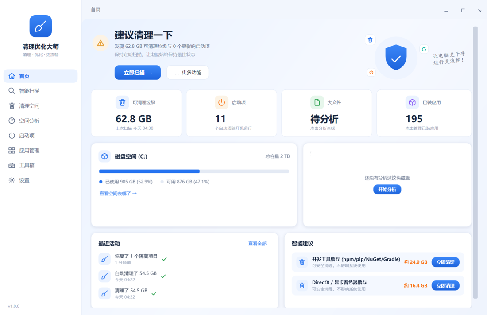
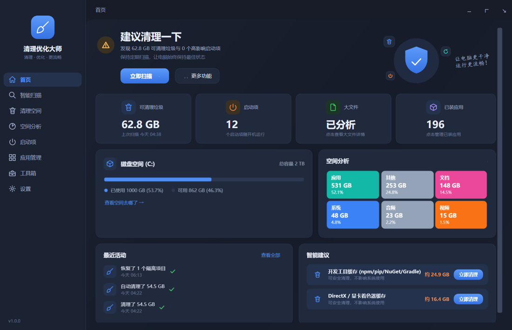

<div align="center">

# 🧹 清理優化大師

**安全、透明、可還原的 Windows 清理與系統優化工具**

[](../../releases/latest)
[](LICENSE)
[](#-快速開始)
[](#-快速開始)

[简体中文](README.md) | [English](README.en.md) | [繁體中文](README.zh-TW.md) | [日本語](README.ja.md)

**清得明白，優化得安心** —— 可解釋、可預覽、可還原，拒絕一切虛假加速。

[⬇️ 下載最新版](../../releases/latest) · [🛠 從原始碼建置](#-快速開始) · [💬 聯絡我們](#-聯絡我們)

</div>

---

## ✨ 介面預覽

| 淺色主題 | 深色主題 |
|---|---|
|  |  |

## ⬇️ 下載

前往 [Releases](../../releases/latest) 頁面取得（SHA256 校驗值見附件 `SHA256SUMS.txt`）：

| 檔案 | 適合誰 |
|---|---|
| `CleanMasterSetup-x.x.x.exe` | 大多數使用者：中文安裝精靈，支援解除安裝 |
| `CleanMaster-x.x.x-win-x64.zip` | 免安裝綠色版：解壓即用，無需 .NET 執行環境（自包含） |

## 🧰 功能總覽

| 模組 | 能力 |
|---|---|
| **首頁** | 裝置狀態模型（良好 / 建議清理 / 空間緊張）、垃圾與啟動項速覽、磁碟概覽、最近活動、智慧建議一鍵清理 |
| **智慧掃描** | 一次涵蓋系統垃圾 / 瀏覽器快取 / 應用快取 / 資源回收桶；結果按風險分組、逐條可預覽檔案明細 |
| **清理空間** | 系統垃圾（暫存檔、當機報告、縮圖、著色器快取、更新快取等）、應用快取（微信 / QQ / Discord / Teams / Steam / Epic / VS Code / JetBrains 等 13 類）、瀏覽器清理（Edge / Chrome / Brave / Opera / Firefox）、隱私痕跡（預設不勾選）、資源回收桶 |
| **空間分析** | 多執行緒全碟掃描、分類統計、資料夾佔用排行樹、大檔案查找（開啟位置 / 移入資源回收桶 / 白名單） |
| **啟動項** | 登錄檔 Run / 啟動資料夾 / 登入排程工作三大來源；啟停機制與工作管理員一致；所有變更可還原 |
| **應用管理** | 解除安裝表完整列舉、呼叫應用自帶的解除安裝程式、解除安裝後確定性殘留偵測（進隔離區可還原） |
| **工具箱** | 隔離區管理、檔案粉碎、重複檔案偵測（內容雜湊，非檔名比對）、清理歷史、Windows 官方捷徑工具 |
| **系統整合** | 深色 / 淺色 / 跟隨系統主題、系統列、首次使用引導、自動清理排程 |

## 🔒 安全設計（產品核心）

- **統一刪除保護**：所有刪除必須經 `SafetyGuard` 校驗；桌面、文件、圖片、下載、System32、WinSxS、Program Files 等在硬編碼拒絕表中，任何規則都碰不到
- **風險四級**：安全 / 低風險預設勾選；需確認項（資源回收桶、更新快取、隱私項）永遠不自動選中
- **隔離區可還原**：非快取檔案先進隔離區（預設保留 30 天），可隨時還原，重名自動處理
- **不跨目錄連結**：目錄遍歷與刪除均不跟隨 Junction / 符號連結
- **可解釋**：每一項都說明「為什麼可以清理、清理後有什麼影響、能否還原、哪個程序正在佔用」
- **自動化安全自測**：`CleanMaster.exe --selftest` 涵蓋 25 項安全斷言，作為發布門禁整合進 CI

## 🚀 快速開始

環境需求：Windows 10 22H2+ / Windows 11，[.NET 8 SDK](https://dotnet.microsoft.com/download/dotnet/8.0)（零第三方 NuGet 相依）。

```bash
git clone https://github.com/smftec/cleanmaster-windows.git
cd cleanmaster-windows
dotnet build src/CleanMaster.App/CleanMaster.App.csproj -c Release
# 執行
src/CleanMaster.App/bin/Release/net8.0-windows/CleanMaster.exe
# 安全自測
src/CleanMaster.App/bin/Release/net8.0-windows/CleanMaster.exe --selftest
```

推送 `v*` 標籤後，GitHub Actions 會自動：建置 → 安全自測 → 發布 → 編譯安裝套件 → 產生校驗和 → 建立 Release 草稿。

## 📦 打包發布

```powershell
powershell -NoProfile -ExecutionPolicy Bypass -File scripts\publish.ps1
```

產出：綠色版目錄、zip 套件、中文安裝套件（自動偵測 [Inno Setup](https://jrsoftware.org/isinfo.php)，安裝套件腳本見 [scripts/setup.iss](scripts/setup.iss)）、`SHA256SUMS.txt`。

取得程式碼簽章憑證後，加兩個環境變數即可輸出簽章版全套產物：

```powershell
$env:CM_SIGN = "1"; $env:CM_SIGN_SUBJECT = "CN=你的名稱"
powershell -File scripts\publish.ps1
```

## 🗺️ Roadmap

- [ ] SignPath Foundation 開源簽章（已提交申請路線）
- [ ] 線上清理規則庫（簽章校驗的熱更新）
- [ ] 啟動耗時實測分析（ETW）
- [ ] Microsoft Store 分發

## 💬 聯絡我們

- 🌐 官網：<https://52xn.com>
- 📮 郵箱：<dev@52xn.com>
- 💚 微信公眾號：微信搜一搜「**AI虚拟助理**」

<div align="center">
  
</div>

## 📄 開源授權

本專案以 **GPL-3.0** 授權條款開源（見 [LICENSE](LICENSE)）：可自由使用、修改、散布，衍生作品需同樣開源；商業授權 / 閉源客製請聯絡 <dev@52xn.com>。

發布產物中的程式碼簽章由 [SignPath Foundation](https://signpath.org) 面向開源專案免費提供（接入中）。
